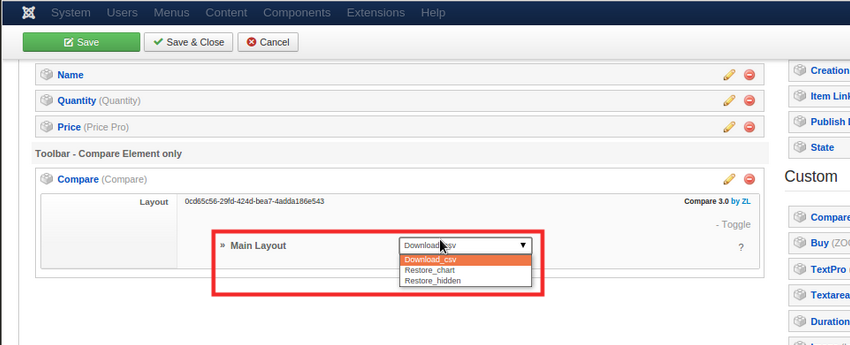

# Element

The **Compare Element** is used for several features showing different rendering layouts depending of the position and layout where it is dropped. When placed into any standard ZOO Layout position it will offer an **Add to Compare / Remove from Compare** button display, while when placed into the **Chart Compare** layout it will adapt to offer differently displays depending on the position:

When dropped in **Row** position it will offer row related displays, such as:

**Header**, will render a Header with an optional Hide/Show childs feature.

- `Title`: The Header title.
- `Fold feature`: The Fold (child hiding feature) state. Allows starting with childs being hidden/unhidden or disallowing the feature completely.

**Main Header**, will render a Header with the appropriate Item name on each column.

- `Link to Item`: If enabled the Item Name will be linked to the Item full view.
- `Remove button`: If enabled a button allowing to remove the Item from the Chart will be rendered.

When dropped in **Toolbar** position will offer a Toolbar related displays, such as:

* **Download CSV**, displays a Download CSV button for the currently displayed Chart data.
* **Restore Chart**, displays a Restore button that will restore the Chart to its initial state (if some Item has been removed for example).
* **Restore Hidden**, displays a button that will restore hidden rows.

