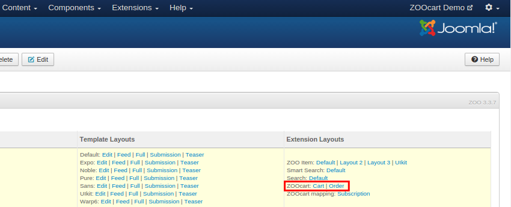

# Variations

The Variations allows selling the same product with different attributes. Those could be for example a color, size, weight, etc. In ZOOcart those are manages with the Variations Element where each variation can have different price, stock and other properties through element value override.

> Notice that there can be only one Variations element, but you can add as many attributes as you need.

## Attributes

The element configuration **Attributes** field allows setting the attributes that will be available for the variations. For example a T-Shirt could have the attribute **Size** and **Color** with **XS, S, M, L** and **Blue, Green, Red** options respectively with a total of 12 possible variation combinations.

> When setting the attributes please make sure all options have both **name** and **value** set.

## Elements Override

The element configuration **Elements** field allows choosing the elements which value will be possible overriding for each variation.

> Please note that this function doesn't support all elements and of those which do only does for simple rendering layouts without JS. Meaning you can change an image of a product but not if that image is part of a Gallery.

## Adding a Variation

Once the attributes set we can add a new variation to the product by editing the Item element. Each element instance represents an attribute and holds the **Attributes, Price, Quantity and Elements** tabs. In the element tab is possible to override other elements values for that specific variation. The maximum amount of instances is equal to the total amount of variations combinations possible.

> Make sure to always set the final price as currently base price is not supported.

## Setup the Views

In order for the Variations to be displayed in the frontend the element must be set in the desired views. Being an standard element you can place it on any render position and even create your custom layouts. For the most common usage we suggest setting it in the **Teaser** and **Full** layouts near by the **AddToCart** button.

The default element layout would render a Dropdown allowing to choose product variation dynamically changing the Price, Quantity and Overridden Elements value Neat! Checkout [this](https://www.youtube.com/watch?v=Bqp4KMcJ-wg) video as an working example.


For element overriding to work as expected the content must be wrapped with an `.element` class, e.g. `
{element}
`, which is true for most positions. If it's not like that try another position or adapt your layout to use the **block** style, e.g. `$this->renderPosition('position', array('style'=>'block'))`.


We strongly recommended rendering the variations in the **Cart** and **Order** views allowing that way adjusting the product details during **Checkout**. To do so just drop the Variations element into the Cart and Order item layouts, ZOOcart will automatically render an Dropdown on Checkout or just an informative text when viewing an Order.

