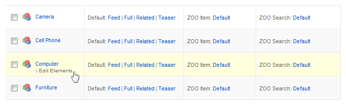

Unless your **App** has been created using our demo site, few integrations steps are required. No matter if you are extending an existing **Item Type** or creating a new one, once it's ready edit its elements and add the ZOOcart basic ones: **PricePro**, **Quantity** and **ZOOcart** from the ZOOcart Element Library block. You can leave the configuration and other elements for later, will be reviewing them in detail in the following sections.

>>> More information about Type configuration can be found at [ZOO documentation](http://yootheme.com/zoo/documentation/advanced/create-new-types).

## Elements Assignment

Now that the elements are part of the product type we can assign them to a rendering position. Assuming we want to render the three of them in the Item full view, access the Full layout edit view and assign each element to one position. Again, leave the configuration as default.

>>> More information about Element assigning can be found at [ZOO documentation](http://yootheme.com/zoo/documentation/advanced/assign-elements-to-layout-positions).

## Store Layouts

**ZOOcart** has it's own **Cart** and **Order** render layouts that allows to fine tune the Item row rendering in the Cart/Order table. As you would do with any other render layout, just Drag and Drop the desired elements to the appropriate position.

>>>>> You can optionally skip this configuration and the default row would be rendered instead.
